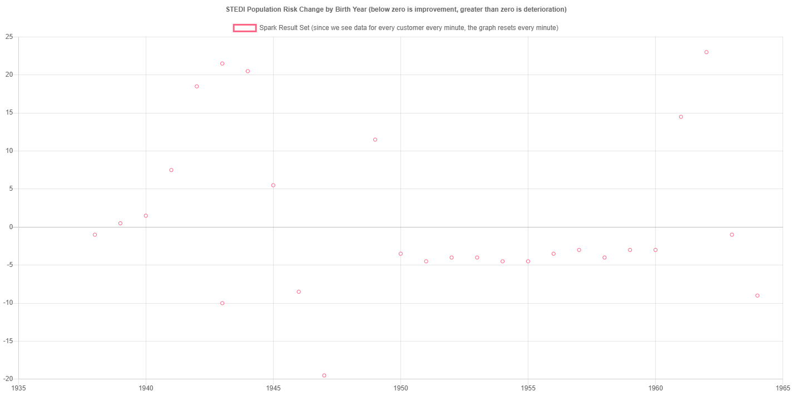

# STEDI — Evaluate Human Balance with Spark Streaming

Udacity Data Streaming (nd029-c2). STEDI assesses fall risk for seniors: a
senior takes a 30-step balance test, and after four assessments the application
produces a risk score. The product team wanted a graph of that risk by birth
year, but the graph was shipping empty — nothing was publishing to the topic it
subscribes to.

This repository fills that gap. A Spark Structured Streaming application joins
the customer records flowing out of Redis to the risk scores published by
STEDI, and writes the combined record to a new Kafka topic that the graph
consumes.




## Read this first

| | |
| --- | --- |
| **[SOLUTION.md](SOLUTION.md)** | How the pipeline works, the two encodings, and what was done beyond the rubric |
| **[ENVIRONMENT.md](ENVIRONMENT.md)** | Why the course Docker environment no longer starts, and what replaced it |
| [README-starter.md](README-starter.md) | Udacity's original starter README, preserved unmodified |

## Heads-up: the course environment is broken upstream

Four of the nine images in the original `docker-compose.yaml` **can no longer be
pulled by anyone**:

* `gcr.io/simulation-images/*` — the STEDI application, the Kafka Connect Redis
  source, and both simulations. The registry now refuses anonymous requests.
* `bitnami/spark:3-debian-10` — deleted when Bitnami withdrew its legacy
  Docker Hub catalogue in 2025.

They have been replaced with documented, reproducible substitutes that keep
every interface identical, so all of the starter code and every `submit-*.sh`
script runs unmodified. The Redis source connector was reimplemented from
scratch (nothing public replaces it — every `kafka-connect-redis` image on
Docker Hub is a *sink*), with contract tests asserting its output against the
payload printed in Udacity's own README.

One consequence to expect: `docker ps` shows **seven** containers, not the nine
the course setup page describes. The banking and trucking simulations are gone
with the same registry, and neither feeds this project — they only drive the
lesson exercises. A `kafka-setup` one-shot is added to declare the topics.

If you are taking this course and landed here because `docker-compose up`
failed, [ENVIRONMENT.md](ENVIRONMENT.md) is the file you want.

## Quickstart

```bash
docker compose up -d                          # builds the two local images on first run
curl -X POST http://localhost:4567/simulation # start the simulated population
```

STEDI creates 30 customers immediately and begins publishing risk scores about
four minutes later, once each has four assessments on file.

```bash
bash project/starter/submit-event-kafkajoin.sh          # the deliverable
bash project/starter/submit-redis-kafka-streaming.sh    # validator: birth years
bash project/starter/submit-event-kafkastreaming.sh     # validator: risk scores
bash project/starter/submit-optional-calculate-score.sh # recompute risk independently
bash project/starter/submit-optional-risk-quality.sh    # audit STEDI's score
```

* Risk graph — <http://localhost:4567/risk-graph.html>
* Spark master UI — <http://localhost:8080>

## Layout

```
project/starter/      the five Spark applications and their submit scripts
stedi-application/    application.conf, mounted into the STEDI container
infra/spark/          Apache Spark 3.3.0 in a Bitnami-compatible layout
infra/redis-source/   Redis MONITOR -> Kafka bridge, plus its contract tests
spark/logs/           driver logs, and the Spark master/worker daemon logs
screenshots/          the populated graph, the cluster UI, the data flow diagram
```
