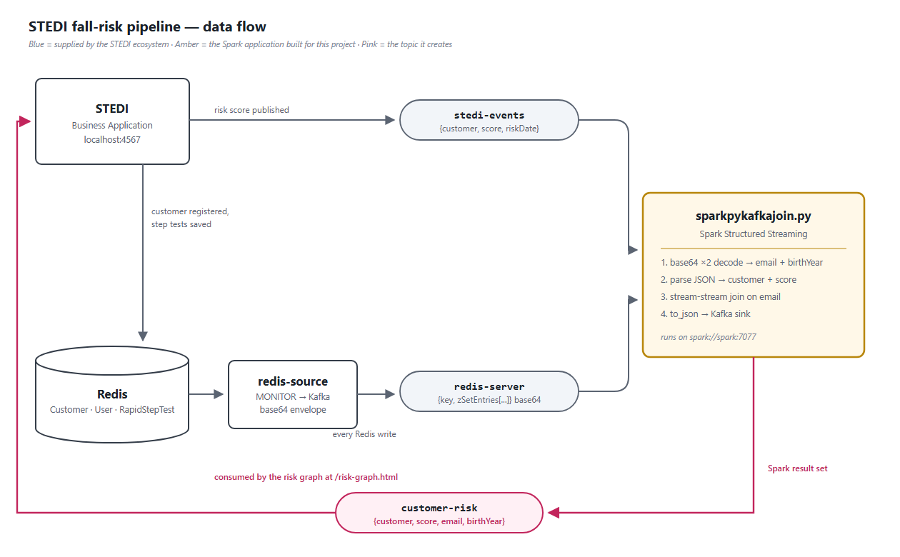

# Evaluate Human Balance with Spark Streaming — solution

The STEDI risk graph was empty because nothing was publishing to the topic it
subscribes to. This project fills that gap: a Spark Structured Streaming
application joins the customer records flowing out of Redis to the risk scores
published by STEDI, and writes the combined record to a new Kafka topic that the
graph consumes.



## The two encodings

The difficulty of this project is that the two inputs are encoded very
differently.

**`stedi-events`** is plain JSON — parse and go:

```json
{"customer":"Eric.Ahmed@test.com","score":-4.5,"riskDate":"2026-09-16T19:00:08.632Z"}
```

**`redis-server`** carries every write made to Redis, wrapped twice. The Redis
key name is base64, and the sorted-set member is a base64-encoded JSON document:

```json
{"key":"Q3VzdG9tZXI=","existType":"NONE","ch":false,"incr":false,
 "zSetEntries":[{"element":"eyJjdXN0b21lck5hbWUiOiJTdGVhZHkgU2VuaW9yIiwi...","score":0.0}],
 "zsetEntries":[{"element":"eyJjdXN0b21lck5hbWUiOiJTdGVhZHkgU2VuaW9yIiwi...","score":0.0}]}
```

`Q3VzdG9tZXI=` decodes to `Customer`, and the element decodes to
`{"customerName":"Steady Senior","email":"steady@stedi.fit","phone":"8015551212","birthDay":"1901-01-01"}`.

Three details in that payload shape the code:

1. **Not every message is a customer.** STEDI also writes the `User` and
   `RapidStepTest` sorted sets, and they arrive on the same topic. The scripts
   filter on the decoded envelope key --
   `where cast(unbase64(key) as string) = 'Customer'` -- so the intent is stated
   outright. Dropping those rows purely because they parse to nulls would work
   today only by accident: a future sorted set carrying an `email` and a
   `birthDay` would quietly leak into the join. The null filter is kept behind
   it as a second line.
2. **`zSetEntries` and `zsetEntries` are the same list under two spellings.**
   Only one is parsed.
3. **`unbase64` returns binary**, so it has to be cast back to a string before
   `from_json` can read it.

## The three required scripts

| Script | What it does | Log |
| --- | --- | --- |
| `sparkpyrediskafkastreamtoconsole.py` | `redis-server` → decode → email + birth year, to console | `spark/logs/redisstream.log` |
| `sparkpyeventskafkastreamtoconsole.py` | `stedi-events` → parse → customer + score, to console | `spark/logs/eventstream.log` |
| `sparkpykafkajoin.py` | joins both on the email address, sinks JSON to `customer-risk` | `spark/logs/kafkajoin.log` |

The join is a **stream-stream inner join**. Both sides keep their rows in state,
which is what the data demands: a customer is written to Redis once, at
registration, but their first risk score cannot exist until four assessments
later. Every source therefore reads with `startingOffsets=earliest` — on
`latest` the customer records would already have gone past and the join would
produce nothing at all.

The sink payload is exactly the documented contract, and exactly what
`public/risk-graph.js` reads (it plots `customerRisk.birthYear` on x and
`customerRisk.score` on y):

```json
{"customer":"Neeraj.Spencer@test.com","score":"-3.0","email":"Neeraj.Spencer@test.com","birthYear":"1955"}
```

`score` is cast to a string so the JSON matches the documented format. That is
safe here because Chart.js 2.9 coerces scale values with a unary `+`, so the
string plots as a number — verified in the bundled `Chart.js`, not assumed.

**On the key casing:** one sample in the project instructions writes `"Score"`
with a capital S, while the starter README and the payload here use `"score"`.
Lower case is the correct one: `risk-graph.js` reads `customerRisk.score`, so a
capitalised key would leave the y value `undefined` and plot nothing at all.

The topic is **read at run time** from `stedi-application/application.conf`
rather than hard-coded — `risk_topic_from_conf()` pulls `kafka.riskTopic` out of
the same file that is mounted into the STEDI container and tells the application
what to subscribe to. Producer and consumer therefore cannot drift apart. The
resolved value is echoed into the log so it can be checked:

```
sinking joined risk scores to Kafka topic 'customer-risk' (read from /home/workspace/stedi-application/application.conf)
```

That parse is worth testing, because a silent fall-back to the default while the
config said otherwise would publish to a topic the graph is not listening to and
leave it mysteriously empty. `infra/tests/test_risk_topic_conf.py` covers the
real config, a missing file, a `riskTopic` planted in another block, a nested
block sitting before the key, and unbalanced braces:

```bash
docker compose exec -T spark python3 /home/workspace/infra/tests/test_risk_topic_conf.py
```

The block is brace-matched rather than regex-delimited for that fourth case: a
pattern that stops at the first `}` would be hidden by any nested block placed
above the key.

### The log shows rows moving, not just a job starting

A Kafka sink prints nothing per batch, so a bare `awaitTermination()` leaves
`kafkajoin.log` recording that the job started and then falling silent. Instead
the query's own progress is polled and reported as each batch commits:

```
batch 0 -> 4000 input rows, 2000 rows written to customer-risk, 11.9 rows/s, join state holds 2082 rows
batch 1 -> 4000 input rows, 2000 rows written to customer-risk, 12.7 rows/s, join state holds 4082 rows
batch 2 -> 4000 input rows, 2000 rows written to customer-risk, 16.4 rows/s, join state holds 6082 rows
```

This is still `awaitTermination` holding the application open — the timeout
argument just lets it return periodically so progress can be printed, and the
loop exits only when the query stops. Two details were needed to make it work:
`maxOffsetsPerTrigger`, because reading from `earliest` otherwise makes batch 0
swallow the entire backlog and report nothing for minutes; and line-buffered
stdout, because Python block-buffers a pipe and `| tee` is a pipe, so the
progress would otherwise sit in the process buffer and be lost outright when the
job is killed.

That last field is deliberate. It reports the join's state store size, which
turns the limitation below from an assertion into something observable.

### Known limitation: the join state is unbounded

The stream-stream join carries no watermark, so its state grows without limit.
The progress above shows it plainly: 2,082 rows, then 4,082, then 6,082 — exactly
2,000 more per batch, with nothing ever ageing out. That is a deliberate trade rather than
an omission. A customer is written to Redis exactly once, at registration, and
can go on being scored indefinitely afterwards, so any time-bounded join would
eventually evict the customer record and silently stop matching that customer's
later risk scores. That is a worse failure than unbounded state, because it is
invisible.

The right fix is not a watermark but a change of shape, and
`sparkpyoptionalboundedjoin.py` demonstrates it rather than just describing it:
materialise the customers into a lookup table and join each micro-batch of risk
scores against that table, turning a stream-stream join into a stream-static
one. The same progress field then reports:

```
batch 2: stream-static join, 2000 of 2000 risk scores matched against 82 known customers
batch 2 -> streaming join state holds 0 rows (bounded by design)
```

Zero streaming state, no watermark, and a customer registered months ago still
matches. The graded `sparkpykafkajoin.py` is deliberately left as the
stream-stream join, because the rubric asks for two *streaming* dataframes to be
joined; the bounded version lives alongside it as a separate script rather than
replacing it.

## Going past the rubric

### The score is checked, not trusted

`sparkpyoptionalriskcalculation.py` recomputes the fall-risk score from scratch,
straight from the raw `RapidStepTest` records on the `redis-server` topic,
following the pseudocode in the brief:

```
currentTestAverageScore  = (d(most recent) + d(2nd most recent)) / 2
previousTestAverageScore = (d(3rd most recent) + d(4th most recent)) / 2
riskScore                = (previousTestAverageScore - currentTestAverageScore) / 1000
```

"The last four tests per customer" is a ranked window, and Structured Streaming
rejects `row_number()` over an ordered window on a streaming DataFrame. The step
tests are therefore accumulated to Parquet and ranked on that static view inside
`foreachBatch`, which also keeps the plan flat instead of growing a union
lineage batch after batch.

`sparkpyoptionalriskquality.py` then puts the two side by side. Across the three
comparison batches in `spark/logs/optional-quality.log`, **80 of the 84 rows
match STEDI exactly**, and the remaining 4 differ by between 0.5 and 2.0 with
the sign intact:

```
+--------------------------+-------------+-------------+-----+--------------------------------+
|email                     |reportedScore|computedScore|delta|verdict                         |
+--------------------------+-------------+-------------+-----+--------------------------------+
|Ashley.Fibonnaci@test.com |26.5         |26.5         |0.0  |MATCH                           |
|David.Anderson@test.com   |33.5         |33.5         |0.0  |MATCH                           |
|Neeraj.Anandh@test.com    |30.0         |30.0         |0.0  |MATCH                           |
|Jerry.Abram@test.com      |-18.5        |-19.0        |0.5  |same direction, different window|
|Ashley.Olson@test.com     |-5.5         |-3.5         |-2.0 |same direction, different window|
```

Those four are not a defect, in either implementation. STEDI scores a customer
against the four tests on file *at the moment the assessment completes*, while
this script always scores the four most recent. A customer who is still testing
has had their window move between the two measurements; a customer who has
stopped converges to an exact match. That is why the verdict column separates
"the number is wrong" from "we measured different windows" instead of reporting
a bare pass/fail — and why every disagreement here is small and same-signed
rather than arbitrary.

### The sink output is captured, not just asserted

A Kafka sink prints nothing, so `kafkajoin.log` shows that the job ran but not
what it wrote. `spark/logs/customer-risk-sample.log` holds the payload itself,
read back off the topic the graph subscribes to — 3,000 messages covering 81
distinct customers, reduced to the first row per customer so the spread of birth
years and scores is visible.

### The environment itself

Four of the nine course images can no longer be pulled by anyone. They were
replaced rather than worked around, and the replacements are documented,
reproducible and tested — see **[ENVIRONMENT.md](ENVIRONMENT.md)**. The
short version:

* `gcr.io/simulation-images/*` now refuses anonymous pulls, taking the STEDI
  application and the Redis source connector with it.
* `bitnami/spark:3-debian-10` was deleted from Docker Hub in 2025.

The Redis source connector was reimplemented in `infra/redis-source/`, with
`test_bridge.py` asserting its output against the base64 strings printed in the
project README, so compatibility is proven rather than hoped for. The Spark
image reproduces the `/opt/bitnami/spark` prefix and the `SPARK_MODE` contract,
so every starter script runs unmodified.

The jobs are also submitted with `--master spark://spark:7077`. The original
scripts pass no `--master` at all, which silently runs the job in the driver's
own `local[*]` JVM and never touches the cluster.

## Running it

```bash
docker compose up -d
```

Then start the simulated population (this is the toggle on the timer page; the
endpoint is unauthenticated):

```bash
curl -X POST http://localhost:4567/simulation
```

STEDI creates 30 customers immediately and begins publishing risk scores about
four minutes later, once each customer has four assessments on file.

```bash
bash project/starter/submit-event-kafkajoin.sh          # the deliverable
bash project/starter/submit-redis-kafka-streaming.sh    # validator: birth years
bash project/starter/submit-event-kafkastreaming.sh     # validator: risk scores
bash project/starter/submit-optional-calculate-score.sh # optional extra
bash project/starter/submit-optional-risk-quality.sh    # optional extra
bash project/starter/submit-optional-bounded-join.sh    # optional extra
```

The graph is at <http://localhost:4567/risk-graph.html>; the Spark master UI, which
shows the applications running on the cluster, is at <http://localhost:8080>.

## Deliverables

| Rubric item | Where |
| --- | --- |
| `sparkpykafkajoin.py` | `project/starter/sparkpykafkajoin.py` |
| `sparkpyeventskafkastreamtoconsole.py` | `project/starter/sparkpyeventskafkastreamtoconsole.py` |
| `sparkpyrediskafkastreamtoconsole.py` | `project/starter/sparkpyrediskafkastreamtoconsole.py` |
| `kafkajoin.log` | `spark/logs/kafkajoin.log` |
| `eventstream.log` | `spark/logs/eventstream.log` |
| `redisstream.log` | `spark/logs/redisstream.log` |
| Spark master + worker logs | `spark/logs/spark-spark-org.apache.spark.deploy.*.out` |
| `stedi-application/application.conf` | `stedi-application/application.conf` |
| Two screenshots of the working graph | `screenshots/stedi-risk-graph-1.png`, `screenshots/stedi-risk-graph-2.png` |

Supporting evidence beyond the required list: `spark/logs/customer-risk-sample.log`
(what the sink actually wrote), `spark/logs/optional-score.log` and
`spark/logs/optional-quality.log` and `spark/logs/optional-bounded-join.log`
(the three optional extras),
`screenshots/spark-cluster-applications.png` (the jobs running on the standalone
cluster) and `screenshots/stedi-risk-graph-3.png`.
